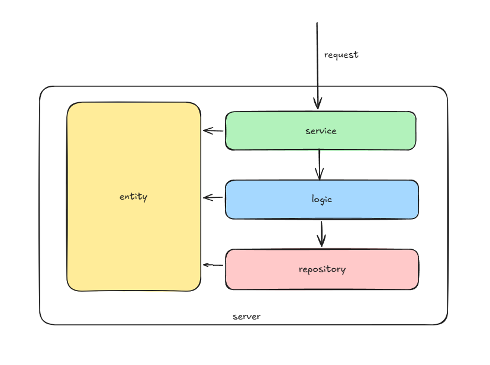

# go-dir-layout
一种面向接口编程的go语言目录分层设计规范


# 整体介绍
在业务系统中，目录分层十分重要，一个好的目录分层结构，可以让业务逻辑易懂、清晰。也可以在需要变更底层依赖的时候，更加简单，不会影响上层的使用（即下层代码的任何变动不会影响下层）。
在此分享一套go语言的分层设计规范，该规范使用分层结构设计，分为以下几层：
- service层：对外提供服务的入口.
- logic层：主要代码逻辑都在这里。
- repository层: 所有的外部依赖调用都在这里，如外部的rpc调用、db调用，设计应该是无业务逻辑的，原子的调用。
- entity层: 业务的实体、通用的方法、配置等。

## 依赖原则
- ✅ 上层可以依赖下层
- ❌ 下层不能依赖上层
- ✅ Entity层不依赖任何层
- ✅ 基础设施层（Repository）只能依赖Entity层
  
除了entity层外，每一层都是单项依赖的，即service层依赖logic层，logic层依赖repository层，entity层为所有层所依赖使用。

# 具体分层介绍

## service层
服务代码层、对外暴露RPC接口的入口，在这里不要有太多的代码逻辑，复杂的逻辑应下沉到logic层，这里应该只调用logic的代码。

## logic层
服务具体的业务逻辑都放在这里，注意这里是纯粹的业务逻辑，包括参数校验、代码逻辑转换、本地缓存、原子接口的逻辑编排、事务的操作、异步任务都应该在这一层执行。
在这里可以去组装编排你所依赖的原子接口（repository层），完成你的业务逻辑。

## repository层
在这里封装你所依赖的原子接口的rpc调用、db操作，不要有业务逻辑。
在这里你可以完成如访问限流、配置中心等操作的抽象，注意这里应该尽可能的抽象依赖，而不是依赖实现，保证下层内部的逻辑变动，不影响上层。如你业务现在依赖的是ZK做配置中心，那你的取名应该是confcenter，而不是zookeeper，这样设计的好处是后续如果你不想使用zk作为配置中心了，你可以很方便的修改，而不是要上层去配合改造。

## entity层
服务内部公用的实体结构，给上面三层所使用，如一些常量、数据结构定义、公用函数逻辑。

# 分层目录结构


```python
|-- README.md                                     # 服务功能介绍文档，必须
|-- main.go                                       # 程序入口，越简单直观越好，必须
|-- config.yaml                                   # 框架配置文件，必须
|-- xx_service.go                                 # 服务入口，每个 service 一个文件，里面是该 service 的所有 rpc 方法，必须
|-- entity                                        # 贯穿整个 server 的通用的数据结构实体定义层，比如配置数据结构，错误码，007 属性监控或者其他各种常量定义，必须
|   |-- xxxutil                                   # 当前 server 需要用到的小工具函数，如某个特殊 url 转换的函数
|   |   -- xxx_util.go
|-- logic                                         # 当前 server 的主要业务逻辑层
|   |-- xxxx                                      # 当前服务的逻辑功能名字，一个服务有多个逻辑功能点则分多个子目录 
|   |   -- api.go                                 # 每一层对外暴露的接口，service 层通过这个接口联通 logic 层，只依赖抽象，不依赖实现
|   |   -- api_impl.go                            # 针对 api 接口的具体实现，所有业务逻辑都在这里完成，文件名根据功能自己决定，与 api.go 同级
|-- repo                                          # 所有第三方接口的外部依赖层
|   |-- confcenter                                # 被依赖的功能点名字
|   |   -- api.go                                 # 第三方依赖包装以后的对外接口，注意：输入输出参数为当前 server 的结构，而不是内部实现细节的结构
|   |   -- zk_impl.go                             # 封装第三方依赖接口的实现细节
|   |-- xxxx                                      # 下游服务的功能名字，注意 entity, logic, repo 都是概念性名词，没有实际意义，不要直接当做包名
|   |   -- api.go
|   |   -- mysql_impl.go
|   |   -- rpc_impl.go
```

每一个api.go文件都定义了这一层对外暴露的接口，如repo/confcenter/api.go文件：
```go
    type ConfCenter interface{
        GetConf(path string) (interface{}, error)
    }

    func New() {
        return newZKImpl()
    }
```


repo/confcenter/zk_impl.go 实现了ConfCenter 这个接口
```go
    type zkImpl struct{
        proxy zk.client
    }

    func (z *zkImpl)GetConf(path string) (interface{}, error) {
        // 调用proxy去获取配置
        return z.proxy.Get(path)
    }

    func newZKImpl() *zkImpl{
        z := &zkImpl{
            proxy: zk.New("xxx.xxx.xx.zk")
        }

        return z
    }
```

如果后面想换成其他的组件作为配置中心，如改成redis作为配置中心，则应该新建文件repo/confcenter/redis_impl.go实现ConfCenter 这个接口
```go
    type redisImpl struct{
        proxy redis.client
    }

    func (r *redisImpl)GetConf(path string) (interface{}, error) {
        // 调用proxy去获取配置
        return r.proxy.Get(path)
    }

    func newRedisImpl() *redisImpl{
        r := &redisImpl{
            proxy: redis.New("xxx.xxx.xx.redisImpl")
        }

        return r
    }
```

上层应用完全感知不到下层内部实现的变化，上层调用方式如logic/business/business_impl.go中调用的逻辑应该是：
```go
    type businessImpl struct{
        confCenter confcenter.ConfCenter
    }

    func (b *businessImpl)XXXX() (error) {
        b.confCenter.GetPath("xxxx")

        return nil
    }

    func newBusinessImpl() *businessImpl{
        b := &businessImpl{
            confCenter: confcenter.New()
        }

        return b
    }
```